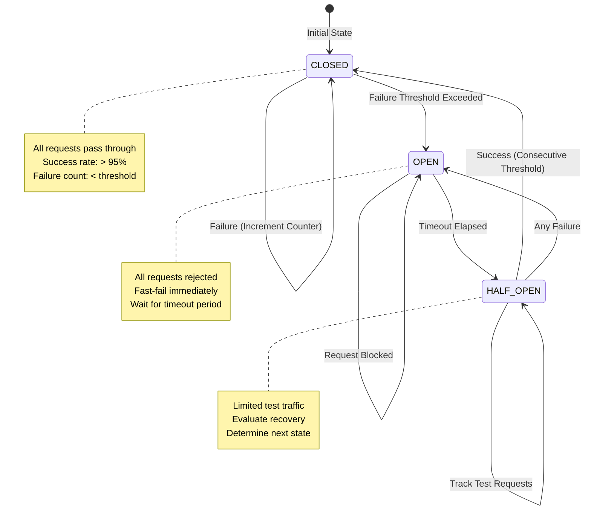

# AegisPay System Architecture

## Table of Contents

- [System Overview](#system-overview)
- [High-Level Architecture](#high-level-architecture)
- [Component Architecture](#component-architecture)
- [Payment Flow Architecture](#payment-flow-architecture)
- [State Machine Architecture](#state-machine-architecture)
- [Event-Driven Architecture](#event-driven-architecture)
- [Resilience Architecture](#resilience-architecture)
- [Data Flow Architecture](#data-flow-architecture)
- [Distributed Systems Architecture](#distributed-systems-architecture)
- [Deployment Architecture](#deployment-architecture)

---

## System Overview

AegisPay is an enterprise-grade payment orchestration platform built on principles of distributed systems, event sourcing, and functional programming. It provides mission-critical reliability for high-volume payment processing.

---

## High-Level Architecture

### Multi-Layer Architecture with Clear Separation of Concerns

---

## Component Architecture

### Core Component Interaction and Responsibilities

---

## Payment Flow Architecture

### End-to-End Payment Processing Flow

---

## State Machine Architecture

### Deterministic Finite Automaton for Payment States

### State Transition Guards and Actions

---

## Event-Driven Architecture

### Event Sourcing and CQRS Pattern

### Domain Events Flow

---

## Resilience Architecture

### Multi-Layer Resilience Strategy

### Circuit Breaker State Machine

---

## Data Flow Architecture

### Payment Data Flow with Event Sourcing

### Intelligent Routing Data Flow

---

## Distributed Systems Architecture

### Distributed Locking and Concurrency Control

### Partition Tolerance and Network Failures

---

## Deployment Architecture

### Multi-Region, High-Availability Deployment

### Container-Based Deployment

---

## Architecture Principles

### 1. **Separation of Concerns**

- Domain logic isolated from infrastructure
- Pure business rules with no side effects
- Adapter pattern for external dependencies

### 2. **Event-First Design**

- All state changes emit events
- Event sourcing as source of truth
- Exactly-once event delivery via outbox pattern

### 3. **Resilience by Design**

- Circuit breakers at every external call
- Retry with exponential backoff and jitter
- Graceful degradation and fallback strategies
- Chaos engineering for continuous validation

### 4. **Correctness Guarantees**

- Distributed locking prevents concurrent modifications
- Optimistic locking prevents lost updates
- Idempotency ensures at-most-once processing
- State machine enforces valid transitions

### 5. **Observability First**

- Structured logging with correlation IDs
- Metrics at every critical path
- Distributed tracing support
- Real-time health monitoring

### 6. **Scalability**

- Stateless API layer for horizontal scaling
- Partitioned data for parallel processing
- Event-driven for async processing
- Caching at multiple layers

### 7. **Security & Compliance**

- Input validation at API boundary
- Audit trail via event sourcing
- PCI-DSS compliance ready
- Secure credential management

---

## Technology Stack

### Core Technologies

- **Language**: TypeScript 5.0+ (strict mode)
- **Runtime**: Node.js 18+ / 20+
- **Build**: pnpm, tsup

### Infrastructure

- **Database**: PostgreSQL (event store, read models)
- **Cache**: Redis (distributed locking, caching)
- **Message Bus**: Kafka / RabbitMQ / AWS SQS
- **Container**: Docker, Kubernetes

### Observability

- **Logging**: Winston, Pino (structured JSON logs)
- **Metrics**: Prometheus, StatsD
- **Tracing**: OpenTelemetry
- **Monitoring**: Grafana, Datadog, New Relic

### Testing

- **Unit**: Jest
- **Integration**: Testcontainers
- **Load**: k6, Artillery
- **Chaos**: Chaos Mesh, Toxiproxy

---

## Performance Characteristics

### Latency Targets

- **P50**: < 50ms (in-memory state transitions)
- **P95**: < 200ms (including gateway call)
- **P99**: < 500ms (with retry)
- **P99.9**: < 2s (with circuit breaker fallback)

### Throughput

- **Single Instance**: 1,000+ TPS (transactions per second)
- **Clustered**: 10,000+ TPS (with horizontal scaling)
- **With Caching**: 50,000+ TPS (read-heavy workloads)

### Reliability

- **Availability**: 99.99% (four nines)
- **Zero Duplicate Payments**: Idempotency + distributed locking
- **Zero Data Loss**: Event sourcing + transactional outbox
- **Zero Silent Failures**: Health checks + circuit breakers

---

## Future Enhancements

### Planned Features

1. **Machine Learning Router**: ML-based gateway selection using historical data
2. **Multi-Currency Support**: Automatic FX conversion and routing
3. **Smart Retry**: AI-powered retry strategies based on failure patterns
4. **Predictive Circuit Breaking**: Proactive failure detection
5. **GraphQL API**: Modern query interface for complex reads
6. **Blockchain Integration**: Support for cryptocurrency payments
7. **Real-Time Analytics**: Stream processing for live dashboards
8. **A/B Testing Framework**: Built-in experimentation for routing strategies

---

## Conclusion

AegisPay's architecture is designed from the ground up for **correctness, reliability, and scale**. By combining proven distributed systems patterns (event sourcing, CQRS, circuit breakers) with modern resilience engineering (chaos testing, intelligent routing), it provides enterprise-grade payment orchestration without compromise.

The system is battle-tested against the hardest problems in payments:

- ✅ No duplicate charges (idempotency + distributed locking)
- ✅ No lost payments (event sourcing + transactional outbox)
- ✅ No cascading failures (circuit breakers + bulkheads)
- ✅ No data corruption (optimistic locking + state machine)
- ✅ No silent failures (health checks + observability)

**Ready for mission-critical workloads from day one.**
